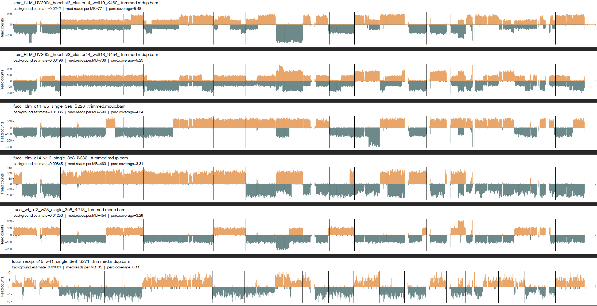

# Plotting read count ideograms for Strand-seq libraries
This pipeline does the following:

1) Takes in BAM files in `TestBAMfiles`, bins read counts and uses relative proportion of W/C reads to call changes in strand state
2) Prints read count ideograms that show state changes and ploidy states and all other relevant output files in `BPR_output`
2) Option to print `Feature file` that orders libraries by either background (low->high), coverage (high->low) or readsPerMb (high->low)
3) Feature file is only read count plots and rints out a user-specified number of the ordered libraries (eg. 10) 

## Quick use
- Insert BAM files in `/TestBAMfiles`
- Run `sh master.sh`

## Incorporation into Alignment Pipeline
- Take one line from `master.sh` and insert into your master alignment script
- Adjust path for input BAM files
- Adjust arguments as needed:
    - 1: Input folder: folder with BAM files
    - 2: Output folder: for BPR output, this is overwrittern and made on the spot
    - 3: Feature file: must either be "feature" if you want read-couny only plotting, or NULL if you dont
    - 4: Feature: can either be "perc.coverage", "background.estimate","med.reads.per.MB"
    - 5: FeatureNo: number of files to show in feature file
    - 6: HalfHalf: FALSE if only top libraries are shown in feature file, if TRUE, shows half top half bottom files after ordering

